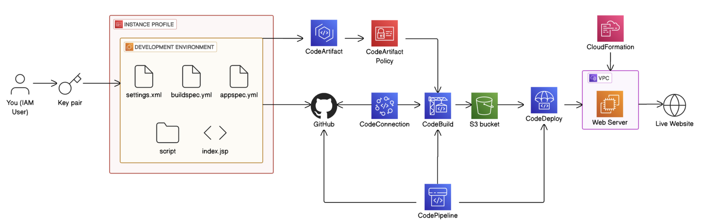

# nextwork-cicd-docs

This repository contains documentation, architectural overviews, and deployment insights for the **7-Day CI/CD Java Web App Project**, which was implemented using various AWS DevOps services and tools.

> **Note:** This was a 7-day challenge focused on mastering CI/CD pipelines using AWS. **Day 6** (CloudFormation) was not completed due to it being part of a premium-only module.

---

## 📘 View Project Documentation Repository
<a href="https://github.com/Kalukwo/nextwork-cicd-web-project">
  Click here to view documentaion
</a>

## Architecture

The project architecture follows a real-world CI/CD setup for deploying a Java web application. The flow involves pushing code to GitHub, building it using CodeBuild, storing artifacts in S3, and deploying to an EC2 production instance via CodeDeploy.

---

## 🔁 CI/CD Pipeline Overview

1. **Developer commits code to GitHub**
2. **CodePipeline** detects the change using **CodeConnections**
3. **CodeBuild** pulls dependencies from **CodeArtifact**, builds the project, and uploads artifacts to **S3**
4. **CodeDeploy** takes artifacts from S3 and deploys to the **Production EC2 Instance**
5. **Scripts** (in the app repo) run on the production instance to stop the old server, install dependencies, and start the new app

---

## ⚙️ Technology Breakdown

### 🧑‍💻 Development Environment
- **Key Pair**: Used to securely SSH into EC2 instances (e.g., development and production environments).
- **Development EC2 Instance**: Used to test manual deployments, simulate the production environment, and verify build artifacts.

### 📦 Dependency Management
- **AWS CodeArtifact**: Maven repository for storing and retrieving Java dependencies.
- **CodeArtifact Policy**: Custom access policies set up to allow CodeBuild to authenticate and pull dependencies.

### 🔄 CI/CD Orchestration
- **AWS CodePipeline**: Main service that automates the end-to-end CI/CD process. It links GitHub changes to CodeBuild and CodeDeploy stages.
- **AWS CodeConnections**: Secure integration with GitHub to automatically trigger pipelines on code push.

### 🛠️ Build Phase
- **AWS CodeBuild**: Compiles the Java app using `pom.xml`, runs tests, and uploads the output (WAR/JAR files) to an S3 bucket.

### 🚀 Deployment Phase
- **AWS S3**: Acts as a staging ground for artifacts built by CodeBuild before they’re picked up by CodeDeploy.
- **AWS CodeDeploy**: Handles deploying the built application to the production EC2 instance using the `appspec.yml` and deployment scripts.

### 🖥️ Production Environment
- **Production EC2 Instance**: The live environment that serves the Java web application to end users. Managed by CodeDeploy during updates.

### 📄 Infrastructure as Code (Not Implemented)
- **AWS CloudFormation**: This was the focus of **Day 6** in the challenge. It was intended to automate infrastructure provisioning. This day was skipped due to it being part of a premium-only section.

---

## 📚 Contents of This Repo

- `architecture-complete.png`: Visual overview of the pipeline and deployment flow
- `day1-day7-notes.md`: Notes, command references, and code snippets from each day's task
- `troubleshooting.md`: Common issues faced during the challenge and how they were resolved
- `links.md`: Reference links to official AWS docs and tutorials

---

## 📝 Final Thoughts

This project was a valuable hands-on experience in setting up an end-to-end CI/CD pipeline using AWS. It touched on real-world DevOps scenarios and helped reinforce cloud-native deployment patterns.

Feel free to clone or fork this documentation to assist in your own learning or projects.

